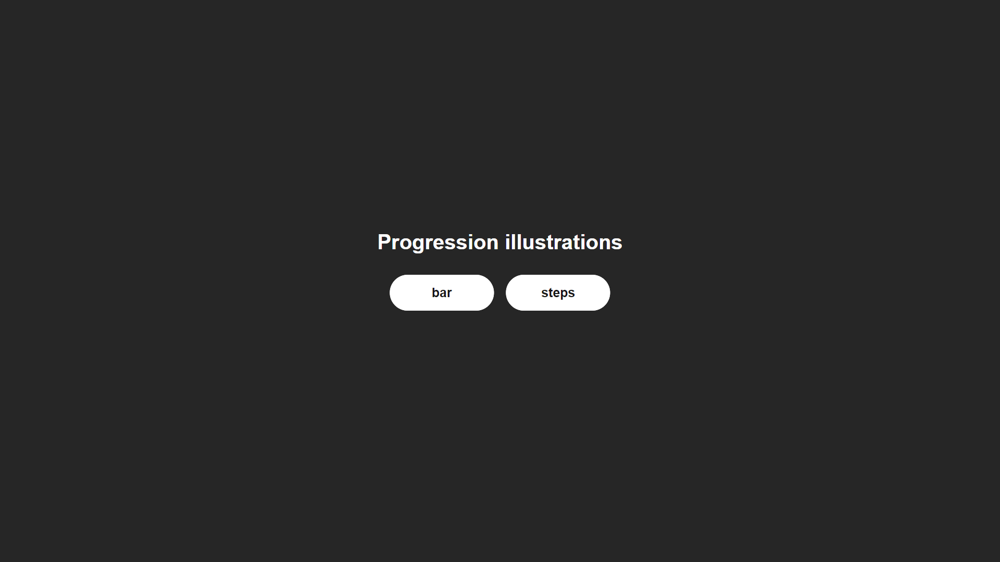
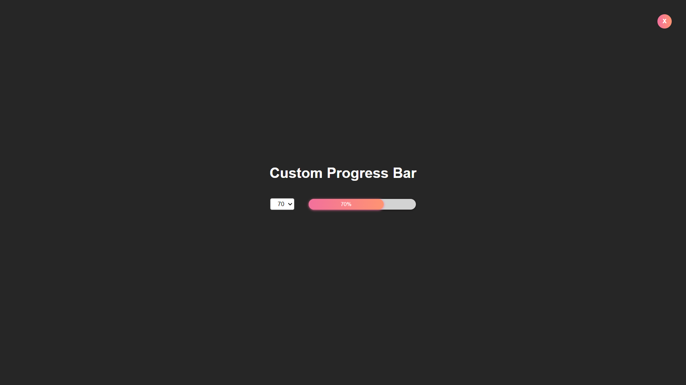
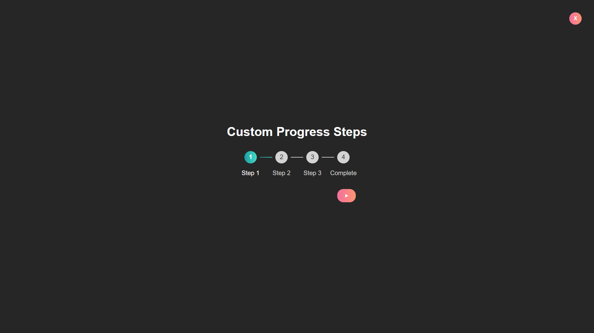

# Progress illustrations

    Personal project | Dynamic visualization of different types of progressions

<kbd></kbd>

> PROBLEMATIC

Decline variations of a feature according to a predefined theme

## Skills developed

- [x] Adaptability of a feature
- [x] React portal hook
- [x] Local state management
- [x] State status management
- [x] Render based on state status
- [x] Style rendering based on component state
- [x] Graphic design without any UI template
- [x] Animations

## Progress bar

<kbd></kbd>

## Progress steps

<kbd></kbd>
